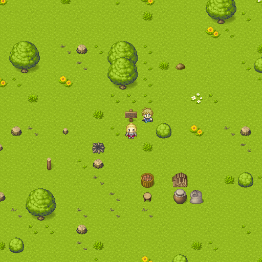

# Grassland

An unfinished attempt at imitating the [RPG Maker](https://www.rpgmakerweb.com/)
grid-based game look using C++17 and [SDL 2](https://www.libsdl.org/)

In this demo you can walk in a 32x32 forest world with some obstacles while a
companion character follows you. It's not particularly entertaining yet.

The tilesets used are freely available and are credited in the
[Credits](#Credits) section below. The tilemaps were created with
[Tiled](https://www.mapeditor.org).

## Screenshot



## Gameplay

* <kbd>W</kbd> <kbd>A</kbd> <kbd>S</kbd> <kbd>D</kbd> Walk
* <kbd>Shift</kbd> + <kbd>W</kbd> <kbd>A</kbd> <kbd>S</kbd> <kbd>D</kbd> Walk in
place

## Build

It should be possible to build this project on Windows, macOS and GNU/Linux.

### Requirements

#### Programs

* C++ compiler with C++17 support
* CMake (tested with v3.19)
* Node.js (needed for running the scripts in the tools folder, tested with
v14.17)
* Tiled (needed for exporting the Tiled maps to CSV files, tested with v1.3)

#### Libraries

* SDL (tested with v2.0.14)
* [SDL_image](https://www.libsdl.org/projects/SDL_image) (tested with v2.0.5)

### Preparing to Build

Ensure the the necessary programs and libraries listed above are installed, then
install the Node.js scripts dependencies using npm like so:

```sh
$ npm install
```

On GNU/Linux Fedora, the libraries listed above can be installed using the _dnf_
package manager with the following command:

```sh
$ sudo dnf install SDL2-devel SDL2_image-devel
````

On Windows, you can use a tool like [Vcpkg](https://github.com/microsoft/vcpkg)
to install them.

### Building

Configure a build in the folder named _build_ using the following CMake command
from the root folder of the project:

```sh
$ cmake -S . -B build
```

Then build the project by running the following command:

```sh
$ cmake --build build
```

The command above will compile the game, call the tools/export-tilemaps.js
script to export the Tiled maps in the assets/Tiled folder to CSV files in the
build folder, and copy the tilesets.

The game can now be run from inside the build folder like so with Bash:

```sh
$ (cd build && ./grassland)
```

## TODO

* Add a start screen with a button to start the game
* Add ambient sounds with a library like SDL_mixer

## Credits

* [FREE RPG Tileset 32x32 by pipoya](https://pipoya.itch.io/pipoya-rpg-tileset-32x32)
* [PIPOYA FREE RPG Character Sprites 32x32 by pipoya](https://pipoya.itch.io/pipoya-free-rpg-character-sprites-32x32)

## License

Everything with the exception of the contents of the _tilesets_ and cmake
folders is dedicated to the public domain under the CC0 1.0 Universal license.

## Resources

* [Introduction to the A* Algorithm](https://www.redblobgames.com/pathfinding/a-star/introduction.html)
* [Implementation of A](https://www.redblobgames.com/pathfinding/a-star/implementation.html)
* [APIByCategory - SDL Wiki'](https://wiki.libsdl.org/APIByCategory)
